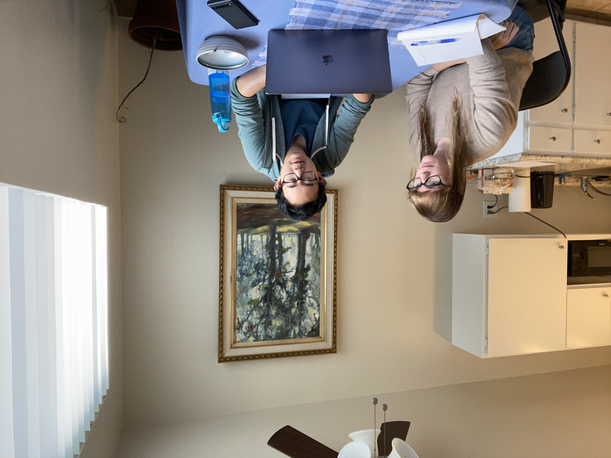
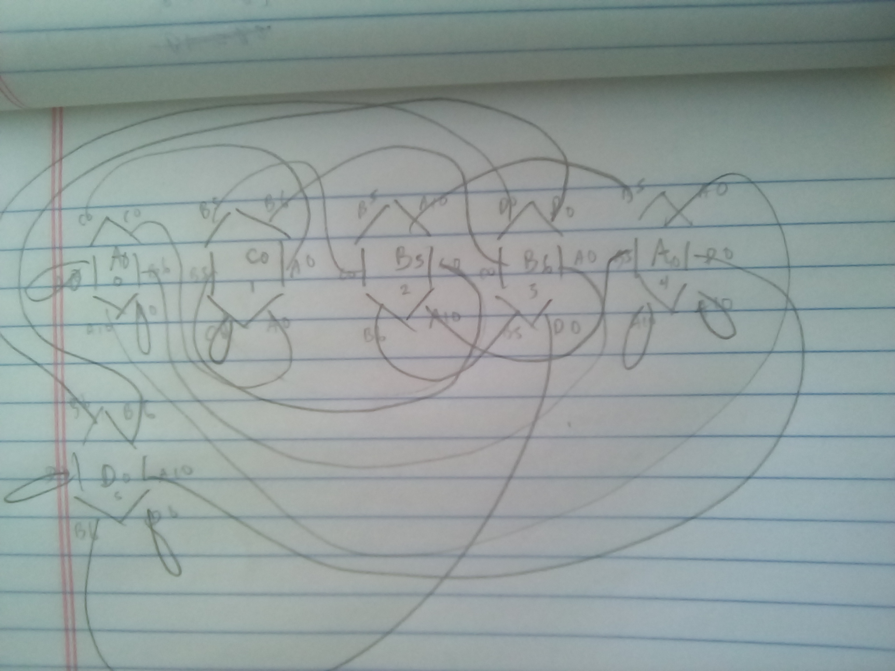
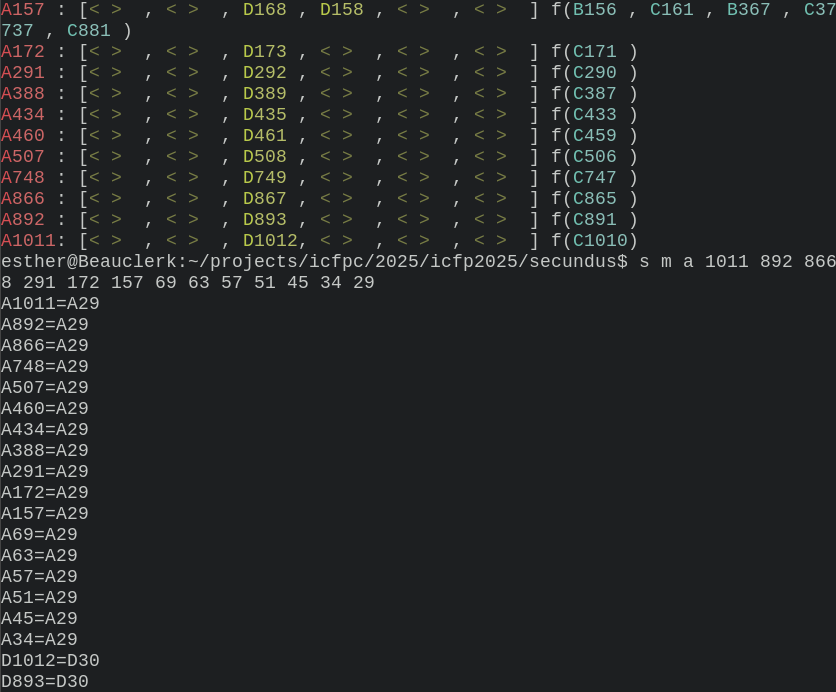
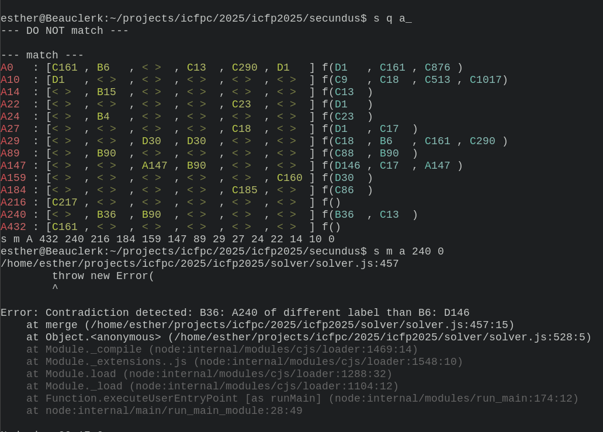
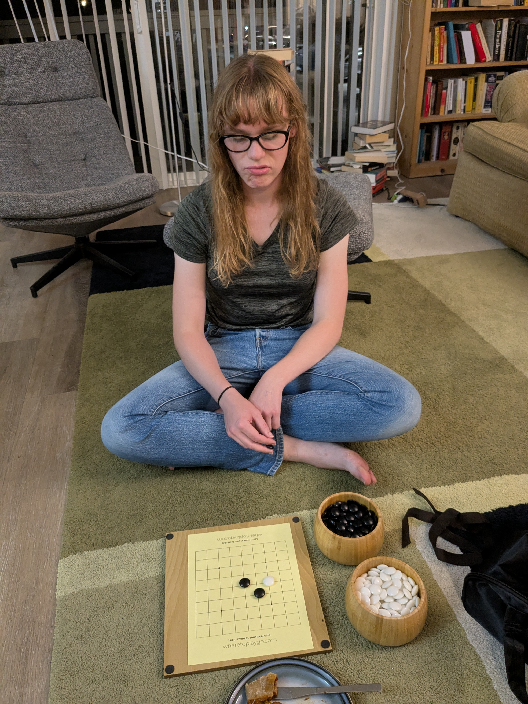

# self.atari at ICFPPC 2025
_September 10, 2025_

This year, my friend [Pandu](https://github.com/prendradjaja) and
I ([Esther](https://github.com/eswitbeck)) participated in the [ICFP (International
Conference of Functional Programming)
contest](https://icfpcontest2025.github.io/), a 72 hour programming competition
that runs annually. Despite the name, competition problems aren't _necessarily_
related to functional programming, although they sometimes include FP \~flavor\~
to acknowledge the subject of the conference. Instead, they tend to be puzzles
designed to be impossible to solve perfectly, challenging teams to hack out tools
that get the best answer they can in a short period of time: equal parts
hackathon and [Advent of Code](https://adventofcode.com/)-style blitz. In other
words, very much both of our cups of tea.

This was our first year participating, and we registered our team as "self.atari"
in a nod to our shared love of both Go (Baduk) and programming. I was extremely
excited to finally set aside time for the competition; I was introduced by
tonsky's excellent [2021 summary](https://tonsky.me/blog/icfpc-2021/) and had
been looking forward to joining ever since. After I completely missed the
previous year, we both planned ahead for a marathon in-person attempt as soon as
we knew the dates. In-person is _the_ way to approach this.

Thankfully, challenges from many previous years are preserved online, which
allows you to go back and try your hand even if you missed it. We did just that
(the famous [2006 competition](http://www.boundvariable.org/task.shtml)) for a
24-hour practice session in advance to set up our tooling and figure out what
works well.

<p align="center">
    
</p>
<p align="center"><em>
    Pair programming with, as expected, several Go breaks
</em></p>

What we learned was 1) even though we wanted to use different programming
languages, we could collaborate in TypeScript as our *lingua franca* and 2) there
was a very real risk that the problem would be hard enough that we wouldn't score
any points at all.[^2006] Accordingly, we had a modest goal: get on the board.

[^2006]: We encountered some very difficult-to-trace number overflow when writing
    32-bit virtual registers. Not a problem in other languages we tried! A
    regular theme was that TypeScript is... an unfortunate *lingua franca* to have.


## The Problem

Sometimes the competitions are a buffet of several smaller tasks and sometimes
they're presented as a single task up front. In both cases, tasks often include
simpler/tutorial problems and escalating larger/harder versions. This year was
the single task variety.

We are introduced in a [beautifully typeset
PDF](https://icfpcontest2025.github.io/specs/task.pdf) the characters Adso of
Milner and William of Backus[^puns], who are sneaking into the "Library
of Lambdas" to read as much as they can (again, FP \~flavor\~).

[^puns]: Puns on _The Name of the Rose_ and computer scientists John Backus and J. Roger Hindley

But the Library is a maze of rooms with six doors and we have to make our own
map. Worse, we can only see the first 'letter' of the names of the rooms (0-4,
but we'll call them 'A', 'B', 'C', or 'D'). And worse again, we can only get so
far before we've run out of time and have to stop exploring!

We can submit plans for which doors to walk through and we'll hear back which
rooms we see. We can do this multiple times, but it can never be longer than the
limit (18 times the number of rooms) and fewer plans gives a better score. Plus,
if you submit an incorrect map, the rooms get shuffled and you have to start over.[^text_adventure]

<p align="center">
      
    </p>
    <p align="center"><em>The representation we're given of a simple complete map</em></p>

[^text_adventure]: Coincidentally, the setup is very reminiscent of the kind of text adventure
    computer games I remember playing as a child (I'm thinking of you,
    [HellHaven](https://www.macintoshrepository.org/9587-hellhaven)):
    ```
    You are in a Dark Room filled with books.

    You can just faintly make out the letter 'A' on a sign.

    You can go through doors:
    [1]
    [2]
    [3]
    [4]
    [5]
    [6]

    What do you do?
    > 5
    ```

There are several challenges available on the website with Latin names, beginning
with a tutorial (_Probatio_) that only has three rooms (and which we are told can
be solved 'by hand'). Next up is six, then twelve, then eighteen...


## First thoughts

There are several hard parts to this problem: if you're in a room 'A', how do you
know _which_ 'A'? And how do you know, after executing a plan, that you've even
been to every room, not to mention every door? We're not even told which door we
came _in_ through! We _are_ told two extra things: every room is reachable, and
there are roughly equal counts of every letter.[^counts]

[^counts]: So for 6 rooms you might have 2 'A's, 1 'B', 2 'C's, and 1 'D'.

First we recognized a key fact: a room is identifiable by the combination of its
name and the names of all the rooms it connects to. In other words, every room
has a 7-letter 'ID'. So maybe you could gradually fill out the IDs while keeping
track of ones you've already seen, then compare the two?

```
currently in __B_CD_

might be:
    A_B__D_
    C__D__A
    ____C__
    ...
```

That still leaves coming up with a good path that gets you to all the rooms. We
couldn't hurt ourselves too much on the tutorial problem, so we decided to just
pick some repeating patterns and see what we learned.

<p align="center">
      
</p>
<p align="center"><em>To start, we picked up that oldest of programming languages: pen and paper.</em></p>

A few things were immediately evident. First, if you always follow the same door,
you're guaranteed to stop learning anything new after you've followed it as many
times as there are rooms; either you got stuck in a short loop along the way, or
you were able to find your way back to the original room. Any more will just
repeat the same thing! Second, alternating loops were difficult to disambiguate:
were you walking back and forth between two rooms? Four?

<p align="center">
  
</p>

We also spooked ourselves with the realization that sometimes there was never a
way to tell two layouts apart. If you're in a room and both doors get you back in
the same room, did the doors connect to each other? Or were they both self-doors?

<p align="center">
  
</p>

Luckily, as we checked, both were considered correct. So all we had to do was
find out where every door went, and then, when multiple doors connected two rooms
together, we could just decide which pairs went together.

To make things more readable, we formatted what we learned in a text editor.

<p align="center">
   1, - B => 0, ..."
    width="75%"
    		min-width="340px"
		max-width="600px"
  />
</p>
<p align="center"><em>Vim: that most practical of programming langauges</em></p>

From there it wasn't too hard to work out a solution by looking through the list;
when you only have three rooms, every letter can only refer to one room!

<p align="center">
  
</p>
<p align="center"><em>Alas, no points for the tutorial. Not on the board yet.</em></p>


## Primus

Next up was _Primus_, with six rooms. Now there were guaranteed to be at least
two pairs of rooms that had the same name. How to tell them apart?

For starters, we could guess by counting the number of times a room showed up.
Sure enough, it looked like A and B showed up twice as often as C and D. But that
wasn't really enough to be sure: what if you were just getting stuck in a loop
between A and B repeatedly? Perusing our rewritten results, we discovered we
could prove it: we started in A, walked through the first door and found C, while
another time we walked through the same door and found B. These can't be the same
A. The problem has revealed itself: this is a giant sudoku puzzle!

We were able to prove a couple of other properties to ourselves and started to
make a little headway.[^fact] Unfortunately, it wasn't always possible to line
these facts up with each other. Say we know there are two A's that don't line up
in door 1, and two A's that don't line up in door 3. These pairs must be the
same, but how do we know which door 3 goes with which door 1? Our notes started
to get a little more convoluted.

[^fact]: For example, if you start in A then walk through one door
    over and over and still see A, there are only two possibilities: either you've
    never left this room or you've been walking back and forth between the two A's.
    So if you've taken an even number of steps, no matter what you must still be in
    the first A.

<p align="center">
  
</p>
<p align="center"><em>0-indexing makes describing problems harder <strong>and</strong> doors harder to keep track of!</em></p>

That seemed like a good place to start actually writing code. We knew a simple
app would make this process a lot simpler and faster.[^vim2] Pandu set
about building a UI that could replicate what we had done on paper while I built
out our own version of the competition server for testing.[^server_mistake]

[^vim2]: We also knew that we could use some code for looking up rooms with doors
    the way we had been in our text file. But in fact, Vim handled lookup
    surprisingly well! If it ain't broke, don't fix it.

[^server_mistake]: We were also penalized for the number of times we _submitted_
    a plan. Thanks to early testing--either a bug in the organizers' code or,
    more likely, user error--we were working under the mistaken impression that
    every time we submitted our score got permanently worse, even if we
    reshuffled the rooms.

<p align="center">
  
</p>

Less than an hour later, we put our new tool to the test. And yes, it was much
easier to click one button than draw hexagons over and over.

We also added a helpful tool to our sudoku toolbelt. Every time you enter a room,
you start by assuming that you've never been there before. When you've done more
walking, you can sometimes prove that this new room must be the same as an old
one. At that point, you can 'merge' the rooms together: now everything that was
true about the new room must also be true of the old. And, good news, if you
start from the beginning again with this in mind, you usually learn even more!

It seemed like this approach _could_ get us to an answer with enough dumb effort.
But you had to be absolutely sure of your proof that two hexes were the same, and
it was hard to fix your mistakes once you had made them. Maybe, Pandu mused,
since backtracking solutions worked for sudoku puzzles, that would work here? But
it wasn't obvious to us how that would work. Convinced enough elbow grease could
go the distance, I unfortunatley forged ahead until 4am without success.

<p align="center">
  
</p>
<p align="center"><em>Descent into madness</em></p>


## Day 2

The next morning I began by doing what I should have done earlier: automating.
What if we just re-walked through the entire path, 'creating' a new room every
time, and then only kept track of which were identical? A command line program
could at least make sure we didn't forget to do any merging when we
learned something new. Plus, now that we had the mental picture of hexagons, we
could just think of them directly as lists of room names.[^carcinization]

[^carcinization]: It does seem like Pandu and I have our own
    [carcinization](https://xkcd.com/2418/) tendencies when making tools. For
    him, it's graphical UIs in the browser; for me, it's CLIs.

<p align="center">
  
</p>
<p align="center"><em>Making progress!</em></p>

To my delight, within about two hours of this (only slightly less stupidly)
manual work, a solution emerged! We were both exhausted by this point (and even
considering giving up) so we were only cautiously optimistic the approach really
worked. All we could do was pick which doors went with each other and submit.
And... success!!

<p align="center">
  
</p>
<p align="center"><em><strong>ON. THE. BOARD.</strong></em></p>

After this point, we took a long break. It was clear the proofs would get
significantly harder with more rooms, Pandu was done working on the contest, and
I knew I wouldn't have much time the next day. _Secundus_ (12 rooms) seemed
possible, but unlikely (Pandu very generously gave me 50% odds). More complicated
problems had been released, but we assumed those were out of reach for us in the
time we had left.

Still hopeful, I spent the evening improving the command line tool, adding
capabilities I thought I might need. It could handle some of the merging for me
so I didn't have to keep track of implications as I went. It would also be nice
to be able to look up rooms (like, which rooms had a name of A, went through
door 1 to a room with a name of B...). And it would be nice to have a program
that would do the door-pair-picking for me.

<p align="center">
  
</p>

I felt satisfied when I determined that the new tools allowed me to start over
and find a _Primus_ solution in about 10 minutes.


## Secundus

Secundus's work began fairly late on Sunday. The contest ended at 5am Monday, so
I had to sprint and hope I got lucky. After about an hour working at it, I was
too exhausted and short on time to prove that my merges were correct and just
started making guesses. Unsurprisingly, this approach did finally hit a brick
wall and I gave up for the evening.

<p align="center">
  
</p>
<p align="center"><em>
    <a href="https://www.youtube.com/watch?v=p93w7MpbZRw">
        If the rule you followed brought you to this, of what use was the rule?
    </a>
</em></p>


## Day four

I woke the next day and immediately realized the implication: guessing at the
next merge until you solved the puzzle or reached a contradiction _was_ the
backtracking solution! If we just maintained a queue of merges... oh, right. The
contest ended three hours ago. In fact, some other teams did use this approach to
some success--we just got there a little too slowly![^backtracking]

[^backtracking]: I have yet to implement it, but an interesting problem with this
    approach is how to avoid extreme memory growth. Instead of mutating anything
    in your representation of the rooms, you can keep track of the equivalencies
    in (and handle lookups through) a union-find data structure.[^union] Tracking
    rooms that are confirmed to be distinct is also a small challenge since every
    room needs to compare with every room previously checked. You can discard
    rooms with identical sets of IDs (`_A__B_A`), sort that set, and then do some
    variety of binary search. Maybe there's an even more clever approach? With
    `N` rooms, if you find `M = ceil(N/4)` distinct rooms with the same name,
    you've been to every room with that name.

[^union]: In fact, I was thinking about this during the contest before we found
    the solution. It's in a TODO: I have the receipts!


## Afterthoughts

Participating was every bit as much a delight as I had hoped! It doesn't get
better than working on a hard problem with a friend and no distractions.

A couple of observations:
- We were uncertain what sort of tools we should set up in advance--after
  all, some teams build custom portals to keep track of their submissions and
  leaderboard standings. In the end, GitHub and plaintext handled most of our
  problems for us. Having a GitHub 'team' set up in advance, though, was the
  right move.
- It also seemed like we made the same mistake several times: working too long
  in tools that didn't quite solve the challenge. Our new rule is "make new tools
  quickly, and be ready to discard them quickly".
- Stateful APIs (the organizers' server) are a bit of a pain.
- Writing about the contest is also great and I hope more teams do it! Reading
  writeups afterwards might actually be the best part of the contest.

I'm very thankful to the organizers for setting this up, and we're already
planning to join again next year!

<p align="center">
  
</p>
<p align="center"><em>Obligatory, if unflattering, Go picture</em></p>
