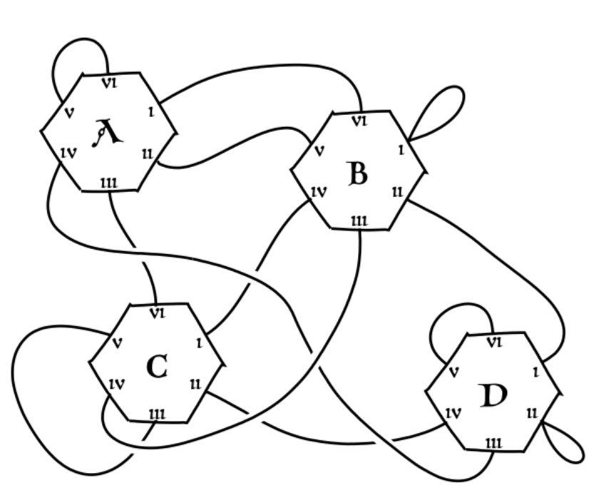
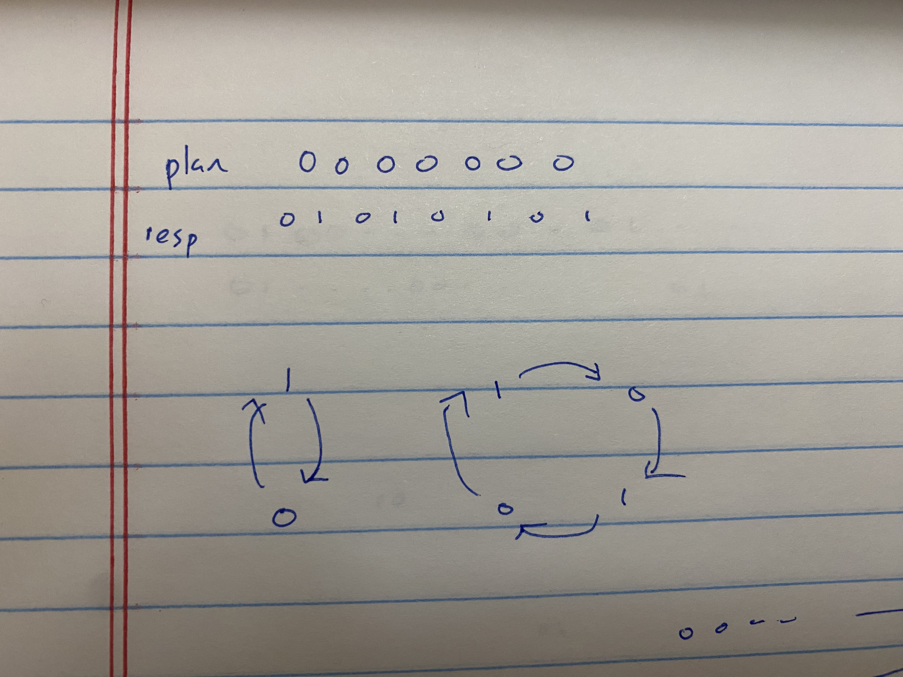
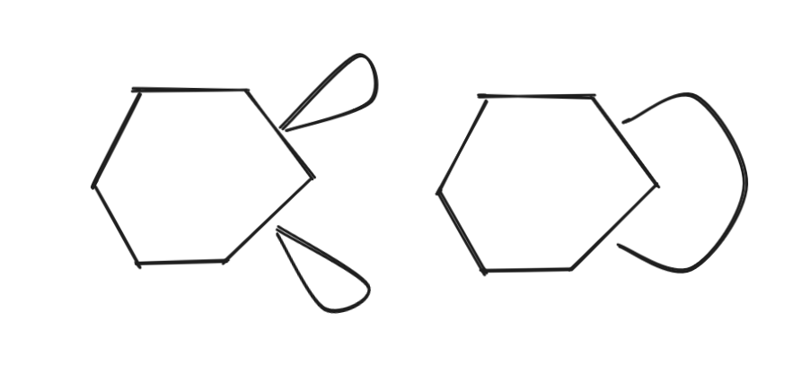
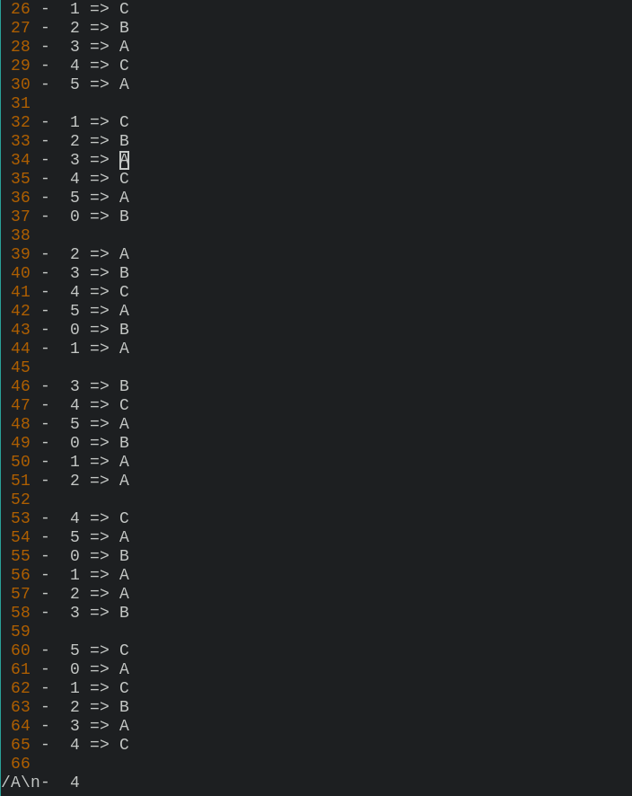
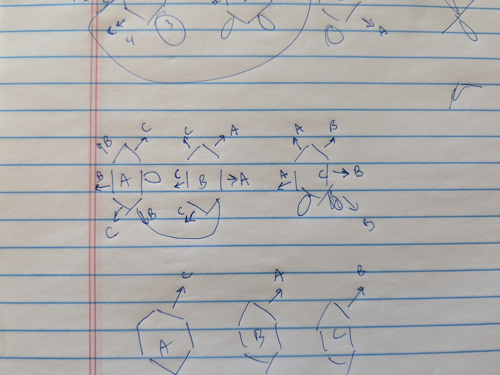
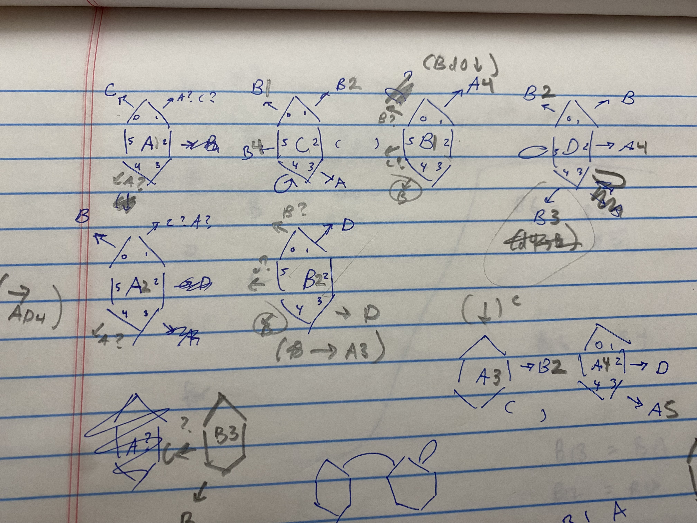
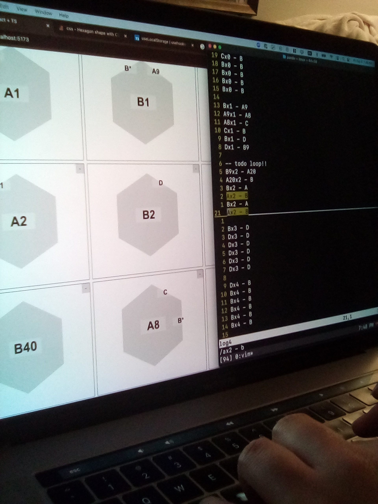
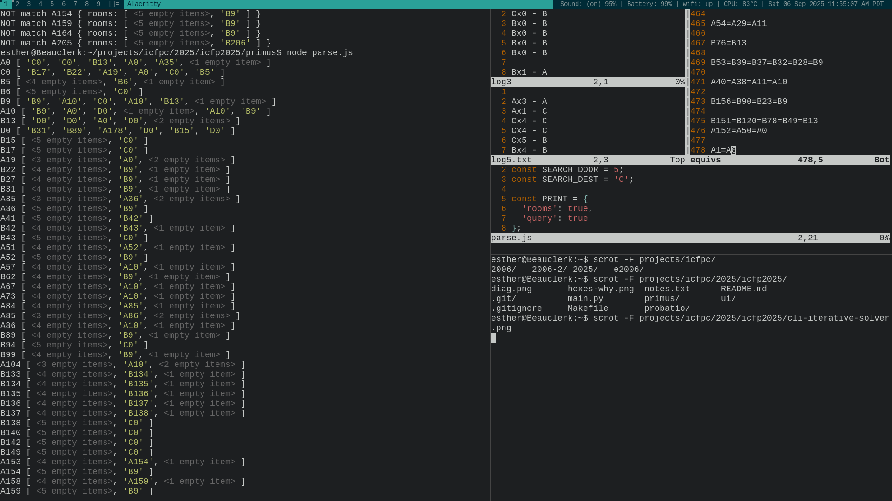
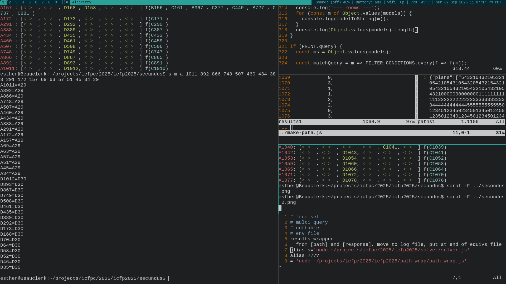
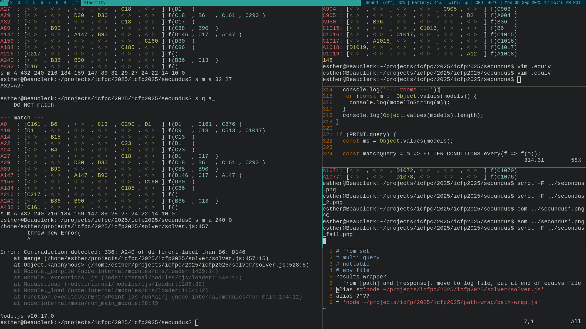

This year, my friend [Pandu](https://github.com/prendradjaja) and [I](https://github.com/eswitbeck) participated in the [ICFP
(International Conference of Functional Programming) contest](https://icfpcontest2025.github.io/), a 72 hour
programming competition that runs annually. Despite the name, competition
problems aren't _necessarily_ related to functional programming, although they
sometimes include functional \~flavor\~ to acknowledge the subject of the
conference. Instead, they tend to be problems designed to be impossible to solve
perfectly, challenging teams to hack out tools that get the best answer they can
in a short period of time: equal parts hackathon and [Advent of
Code](https://adventofcode.com/)-style blitz. In other words, very much both
of our cups of tea.

This was our first year participating, and we adopted the team name "self.atari"
in a nod to our shared love of both Go (Baduk) and programming. I was extremely
excited to finally set aside time for the competition; I was introduced by
tonsky's excellent [2021 summary](https://tonsky.me/blog/icfpc-2021/) and had
been looking forward to joining ever since. After I completely missed the
previous year, we both planned ahead for a marathon in-person attempt as soon as
we knew the dates (this is absolutely the best way to approach it).

Thankfully, challenges from many previous years are preserved online, which
allows you to go back and try your hand even if you missed it. We did just that
(the famous [2006 competition](http://www.boundvariable.org/task.shtml)) for a
24-hour practice session in advance to set up our tooling and figure out what
works well.

<br />
_Pair programming with, as expected, several Go breaks_

What we learned was 1) despite differing language preferences, we could
collaborate in TypeScript as our *lingua franca* and 2) there was a very real
risk that the problem would be hard enough that we wouldn't score any points at
all. (In the case of 2006, it was some difficult-to-find overflow in our 32-bit
registers. This problem vanished when we re-implemented it in another language, but
it clearly would have lost us a full day. A regular theme was that TypeScript
is... an unfortunate *lingua franca* to have). Accordingly, we had a modest goal:
get on the board. If we made it out of the bottom 20%, we would have performed
amazingly well.

### The Problem

Sometimes the competitions are a buffet of several smaller tasks (which you might
gradually discover more of as you go!) and sometimes they're presented as a
single task up front. In both cases, tasks often include simpler/tutorial
problems and escalating larger/harder versions. This year was the single task
variety.

We are introduced in a [beautifully typeset
PDF](https://icfpcontest2025.github.io/specs/task.pdf) to our dynamic duo Adso of
Milner and William of Backus (puns on *The Name of the Rose* and computer
scientists John Backus and J. Roger Hindley), who are sneaking into the Library
of Lambdas to read as much as they can (again, functional \~flavor\~).

Unfortunately, the Library is built as an enormous maze of hexagonal rooms and
there isn't a map, so we'll need to make our own. Worse, it's so hard to read the
names of the rooms that we can only ever see the first 'letter' (0-3, but we'll
write them as 'A', 'B', 'C', or 'D'). Worse still, we can only visit so many
rooms before the sun rises and we have to have snuck back out!

We'll have to plan ahead which of the six doors we'll walk through again and
again to come up with a full map. We can start over and follow as many plans as
we want, but none can be longer than the limit (18 times the number of rooms) and
we get a better score for using fewer plans. We do this by messaging the
competion organizers' server. But be careful! If you guess wrong or change which
problem you're looking at, the rooms get re-randomized.

<br />
_The representation we're given of a simple complete map_

Coincidentally, the setup is very reminiscent of the kind of text adventure
computer games I remember playing as a child:
```
You are in a Dark Room filled with books.

You can just faintly make out the letter 'A' on a sign.

You can go through doors:
[1]
[2]
[3]
[4]
[5]
[6]

What do you do?
> 5
```

There are several challenges with Latin names, beginning with a tutorial
(_Probatio_) that only has three rooms (and which we are told can be solved 'by
hand'). Next up is six, then twelve, then eighteen...

### First thoughts

There are several hard parts to this problem: if you're in a room 'A', how do you
know _which_ 'A'? And how do you know, after executing a plan, that you've even
been to every room, not mention every door? We're not even told which door we
came _in_ through! We _are_ told two extra things: every room is reachable, and
the labels are evenly distributed (so for 6 rooms you might have 2 'A's, 1 'B', 2
'C's, and 1 'D').

First we recognized at least one key fact: a room is identifiable by the
combination of its label and the labels of all the rooms its doors touch. In
other words, every room has a 7-letter 'name'. So maybe you could gradually fill
out letters in the names while keeping track of the other ones you've already
seen, then compare the two?

```
currently in __B_CD_

might be:
    A_B__D_
    C__D__A
    ____C__
    ...
```

That still leaves the problem of how to come up with a good path that will get
you to all the rooms. We couldn't hurt ourselves too much on the tutorial
problem, so we reasoned we might as well pick just pick something and see what we
learned. We had 54 steps to choose. Why not just pick some repeating patterns of
6 and piece them together? We typed out our plan, sent it to the server, and we
were off to the races!

<br />
_To start, we picked up that oldest of programming languages: pen and paper._

A few things were immediately evident. First, if you always follow the same door,
you're guaranteed to stop learning anything new after you've followed it as many
times as there are rooms; either you got stuck in a short loop along the way, or
you were able to find your way back to the original room. Any more will just
repeat the same thing! Second, alternating loops were difficult to disambiguate:
were you walking back and forth between two rooms? Four?



We also spooked ourselves with the realization that sometimes there was never a
way to tell two layouts apart. If you're in a room and both doors get you back in
the same room, did the doors connect to each other? Or were they both self-doors?



Luckily, as we checked, either solution was considered correct. So all we had to
do was find out where every door went, and then, when multiple doors connected
two rooms together, we could just decide which pairs went together.

To make things more readable, we paired our plan with the result and adopted our
naming scheme of 'A', 'B'... so we could just read what we had done in a text
editor.

<br />
_Vim: that most practical of programming langauges_

From there it wasn't too hard to work out a solution by looking through the list;
when you only have three rooms, every letter can only refer to one room!

<br />
_Alas, no points for the tutorial. Not on the board yet_

### Primus

Next up was _Primus_, a set of six rooms. Now there were guaranteed to be at
least two pairs of rooms that had the same name. How to tell them apart?

For starters, we could guess by just counting the number of times a room showed
up. Sure enough, it looked like A and B showed up twice as often as C and D. But
that wasn't really enough to be sure: what if you were just getting stuck in a
loop between A and B repeatedly? Perusing the logs, we discovered we could prove
it: we started in A, walked through the first door and found C, while another
time we walked through the same door and found B. These can't be the same A. The
problem has revealed itself: this is a giant sudoku puzzle!

We were able to prove a couple of other properties to ourselves and started to
make a little headway. For example, if you start in A then walk through one door
over and over and still see A, there are only two possibilities: either you've
never left this room or you've been walking back and forth between the two A's.
So if you've taken an even number of steps, no matter what you must still be in
the first A.

Unfortunately, it wasn't always possible to line these facts up with each other.
We know there are two A's that don't line up in door 1, and we know there are two
A's that don't line up in door 3. These pairs are obviously the same, but how do
we know which door 3 goes with which door 1? Our notes started to get a little
more convoluted.

<br />
_0-indexing makes describing problems harder *and* doors harder to keep track
of!_

That seemed like a good place to start actually writing code. We knew a simple
app would make this process a lot simpler and faster. We also knew that we could
use some code for looking up rooms with doors the way we had been. But in fact,
Vim handled lookup surprisingly well! If it ain't broke, we reasoned. Pandu set
off on building a UI that could replicate what we had done on paper while I built
out our own version of the competition server. (We were also penalized for the
number of times we talked to the server. Thanks to early testing--either a bug in
the organizers' code or, more likely, user error--we were working under the
mistaken impression that every time we talked to the server our score got worse,
even if we reset.)



Less than an hour later, we put our new tool to the test. And yes, we confirmed,
it was much easier to click one button than draw hexagons over and over.

By now we added a helpful tool to our sudoku toolbelt. Every time you enter a
room, you can assume that you've never been there before, starting to collect
facts about this new room. When you've done a lot more walking, you're sometimes
able to prove to yourself that this new room must be the same as an old one. At
that point, you can 'merge' the rooms together, now that all the facts about the
new room must also be true of the old. And good news: if you start from the
beginning again with your updated facts, you usually learn even more!

It seemed likely this approach _could_ get us to an answer, if we worked at it
hard enough. There was just one problem: you had to be absolutely sure you could
prove to yourself two hexes were the same, and it wasn't easy to find your
mistakes once you had made them. Perhaps, Pandu mused, since backtracking
solutions worked for sudoku puzzles, something similar could be applied here? We
could see from the leaderboard that some teams had found perfect solutions with
to all the posted problems, so maybe it was something like that. But it wasn't
obvious to us how that would work. Convinced our UI and enough elbow grease could
go the distance, I forged ahead trying to think through the problem until an
unfortunate 4am without success.

<br />
_Descent into madness_

### Day 2

The next morning I began by doing what I should have done earlier: automate.
What if we just walked through the entire path, 'creating' a room every time, and
then only kept track of which were identical? A CLI program could at least make
sure we didn't forget to do any of those merges. Plus, now that we had the mental
picture of hexagons, we could just think of them directly as lists of room names.
(It does seem like Pandu and I have our own
[carcinization](https://xkcd.com/2418/) tendencies when making tools. For him,
it's graphical UIs; for me, it's CLIs.)

It also started to look like our plan hadn't hit every door. Well, armed with
what we now knew about the library, we could make some educated guesses about how
to get to the doors we had missed, adopting a few new patterns in the process. We
wondered, how much of this library would you expect to see on a random walk? It
turned out, winning teams did in fact just use completely random walks. Clearly,
we should have tried the more obvious strategy! With a second plan execution, I
returned to work while Pandu gave some more consideration to backtracking.

<br />
_Making progress!_

To my delight, within about two hours of this (only slightly less) manual work, a
solution emerged! We were both exhausted by this point (and even considering
giving up) so we were only cautiously optimistic. Did this approach really work?
All we could do was pick which doors went with each other and submit. And...
success!!

<br />
_ON. THE. BOARD._

After this point, we took a long break. It was clear the proofs would get harder
and harder with more rooms, Pandu was now done working on the contest, and I knew
I wouldn't have much time the next day. _Secundus_ (12 rooms) seemed possible,
but unlikely. Pandu very generously gave me 50% odds of completing it in the time
we had left. More complicated problems had been released, but we already assumed 
those to be out of reach.

Ever hopeful, I spent the evening gearing up by making improvements to the CLI,
adding capabilities I thought I might need. For starters, it could handle some of
the work for me so I didn't have to think about which merges implied other
merges. It would also be nice to be able to look up rooms I knew had certain
properties (like, which rooms had a label of A, went through door 1 to a room
with a label of B...). And it would be nice to have a program that would do the
door-pair-picking for me.

<br />
_The CLI gets a facelift_

I felt satisfied when I determined that the new tools allowed me to start over
and find a _Primus_ solution in about 10 minutes.

### Secundus

Secundus's work began fairly late on Sunday. The contest ended at 5am Monday, so
I knew I had to sprint and hope I got lucky in trying to solve it with the new
tools. By the time I had spent about an hour working at it, I was too exhausted
and short on time to prove that my merges were correct and just started making
educated guesses. Alas, this approach did finally hit a brick wall and I gave up
for the evening.

<br />
_If the rule you followed brought you to this, of what use was the rule?_

### Day four

I woke the next day and immediately realized the implications of what I had done:
merging rooms and guessing at the next merge until you solved it or reached a
contradiction _was_ the backtracking solution! And what's more, I had also
figured out to how keep track of how many distinct rooms we had seen. If we just
maintained a queue of merges with a before and after state... oh, right. The
contest ended three hours ago. Ah, well! In fact, some teams did use this
approach to some success--we just got there a little too slowly!

### Afterthoughts

I'm extremely glad we joined this contest. It doesn't get better than working on
a hard problem with a friend and no distractions. We were uncertain what sort of
tooling would be useful beforehand--after all, some teams build custom portals to
keep track of their submissions and leaderboard standings. In the end, GitHub and
plaintext handled most of our problems for us. Having a GitHub 'team' set up in
advance, though, was a very helpful move.

It also seemed like we made the same mistake several times: working too hard
using tools that didn't quite solve the challenge. When participating in the ICFP
contest, make new tools quickly and be prepared to discard them just as fast.

All in all, this was an absolute delight! Our many thanks to the organizers for
putting this together. We'll plan to be back again next year!
